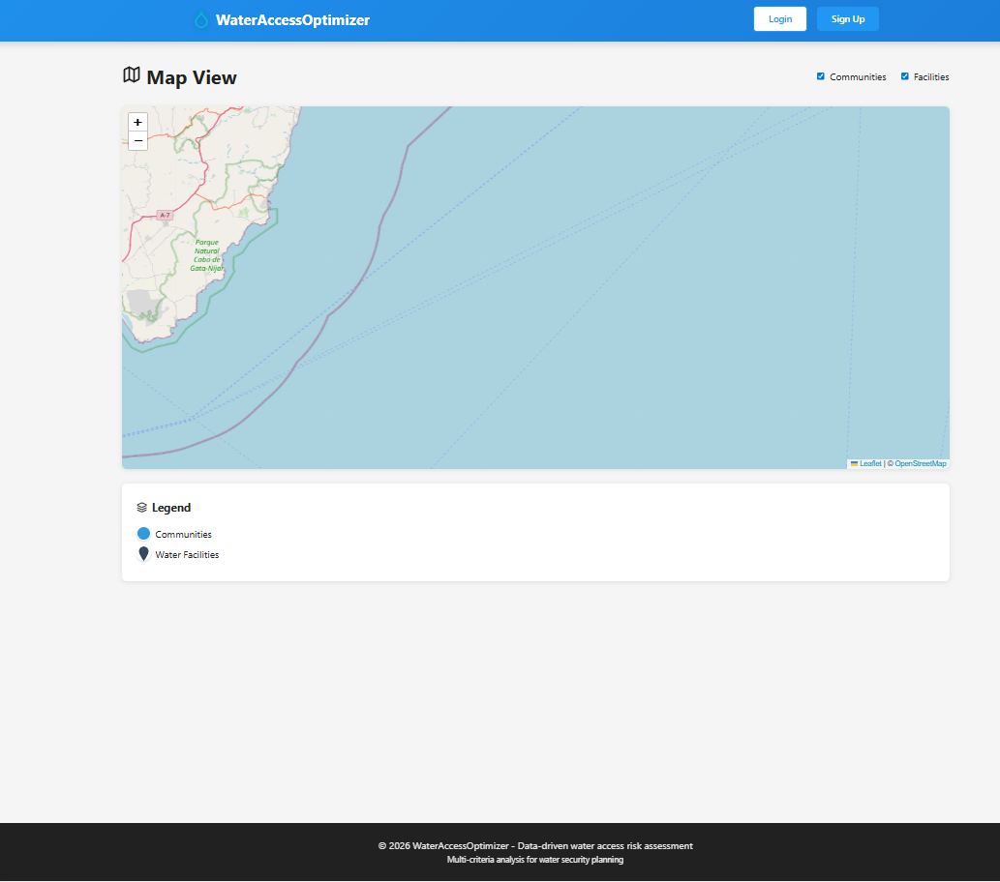
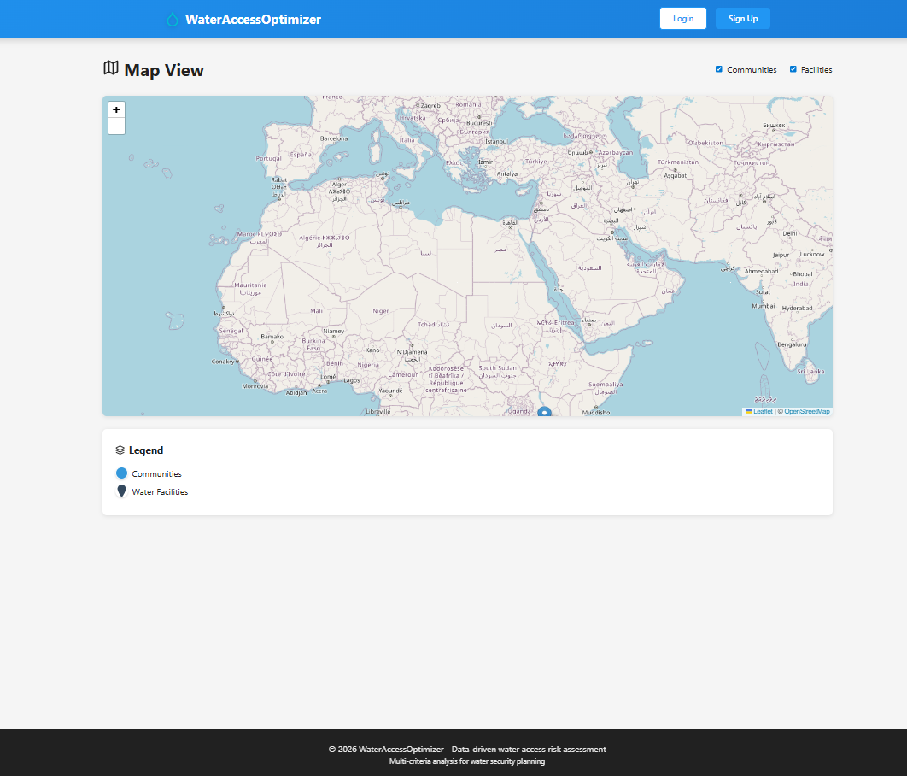
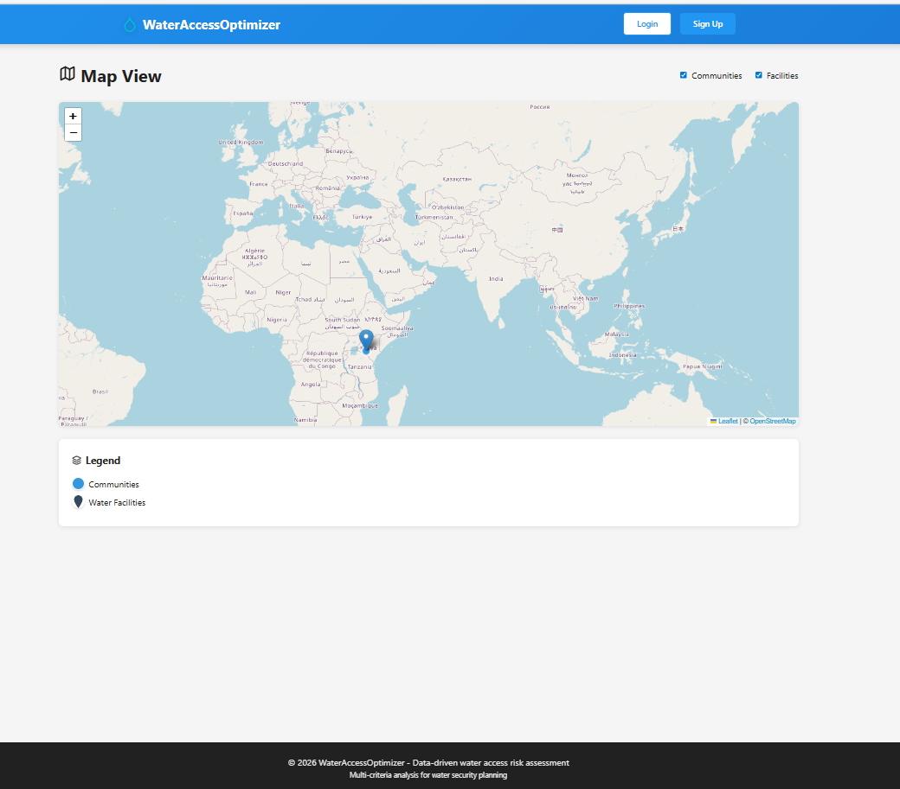
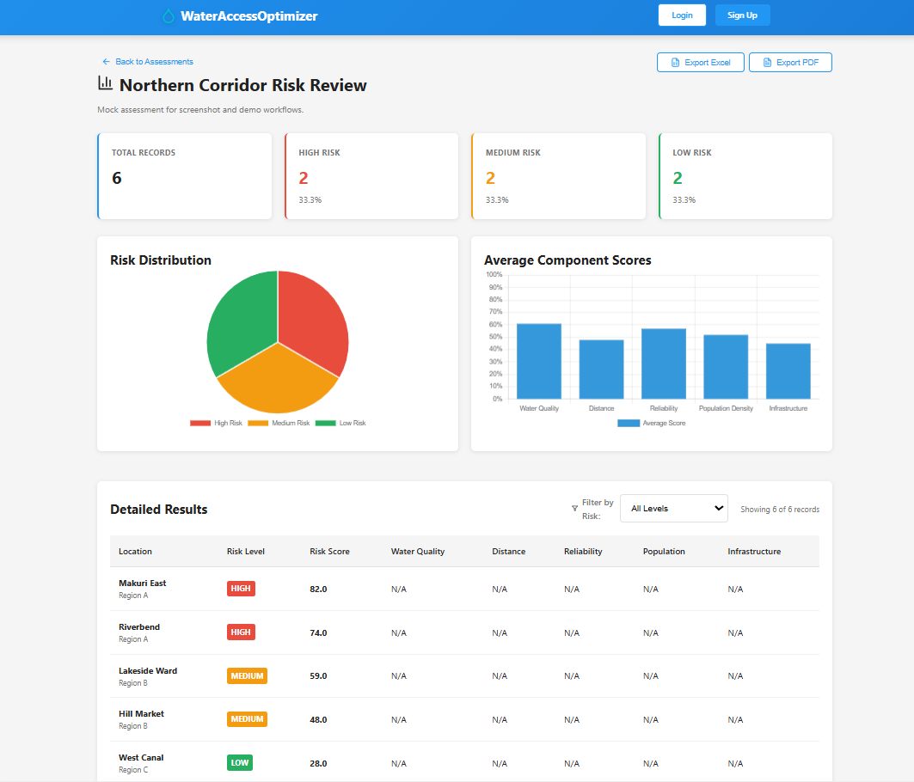
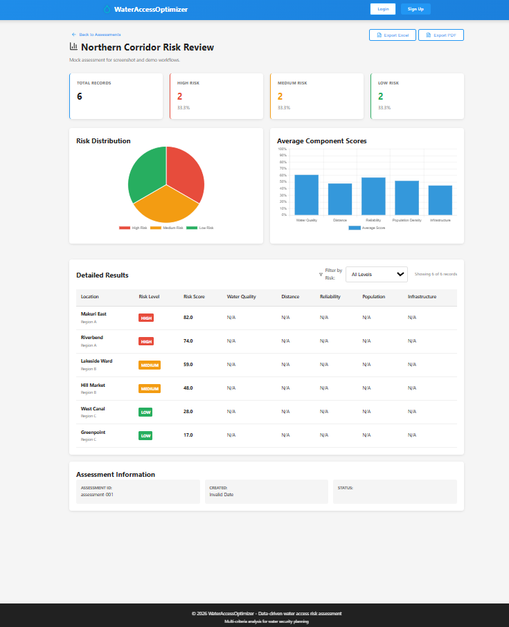
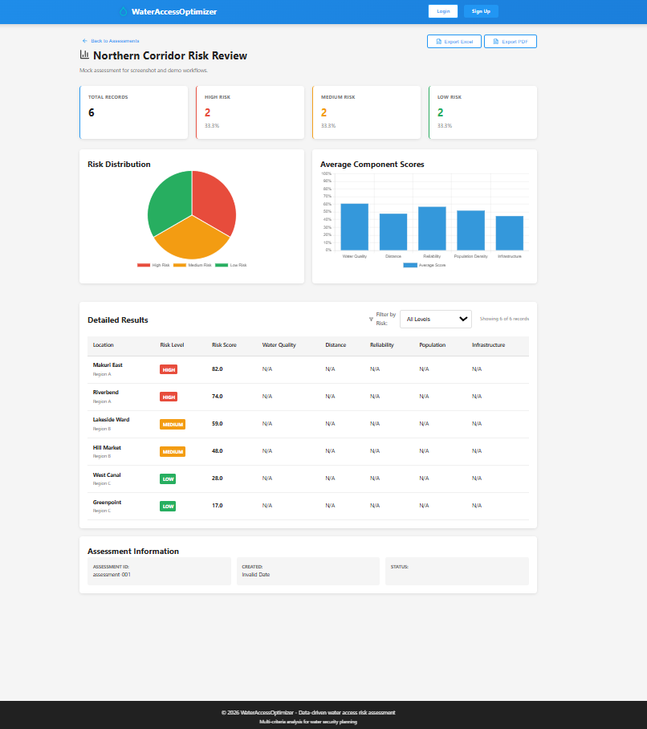
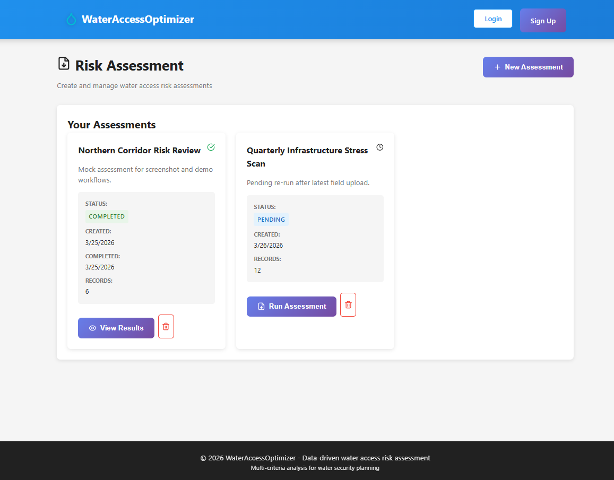

# WaterAccessOptimizer

WaterAccessOptimizer is an open-source web application for uploading water-access datasets, visualizing mapped records, and running explainable risk assessments.

This release is centered on the current MVP workflow:

- authenticate or use demo mode
- upload hydrological, community, and infrastructure CSV data
- inspect communities and facilities on the map
- create and run risk assessments
- review charts, tables, and exports

## Status

- Release version: `1.0.0`
- Frontend verification: `npm run lint`, `npm run test -- --run`, and `npm run build` pass in `frontend/`
- Demo mode: available and useful for screenshots or walkthroughs
- Primary deployment path for this release: `docker-compose.prod.yml`

## Screenshots

### Dashboard


### Data Upload


### Map View


### Risk Assessments


### Assessment Results


### Additional Views



## What Is In Scope

- React frontend in `frontend/`
- Auth service in `backend/auth-service/`
- Data service currently packaged from `backend/api-gateway/`
- PostgreSQL-backed backend services
- Optional AI model service in `ai-model/`
- Optional Prometheus and Grafana in `docker-compose.prod.yml`

## Quick Start

### Option 1: frontend demo mode

This is the fastest way to review the UI without logging in.

```bash
cd frontend
npm install
npm run dev:demo
```

Open [http://localhost:5173](http://localhost:5173). Demo mode seeds an authenticated session and mock application data.

### Option 2: Docker release stack

```bash
cp .env.example .env
# update secrets in .env
docker-compose -f docker-compose.prod.yml up -d
```

Primary URLs:

- Frontend: [http://localhost](http://localhost)
- Auth service: [http://localhost:8081](http://localhost:8081)
- Data service: [http://localhost:8087](http://localhost:8087)
- AI model: [http://localhost:8000](http://localhost:8000)
- Prometheus: [http://localhost:9090](http://localhost:9090)
- Grafana: [http://localhost:3000](http://localhost:3000)

## Local Development

### Frontend

```bash
cd frontend
npm install
npm run dev
```

Useful scripts:

- `npm run dev`
- `npm run dev:demo`
- `npm run lint`
- `npm run test -- --run`
- `npm run build`

### Backend

The backend is Java/Spring-based and requires Java 17+ and Maven.

```bash
cd backend/auth-service
mvn spring-boot:run

cd ../api-gateway
mvn spring-boot:run
```

Current local defaults used by the frontend:

- Auth API: `http://localhost:8081/api/v1/auth`
- Data API: `http://localhost:8087/api/v1`

## Architecture

This repository still contains older modules and planning documents, but the current release surface is:

```text
frontend -> auth-service
frontend -> data-service
auth-service -> postgres
data-service -> postgres
optional: frontend/data-service -> ai-model
```

Important repo note:

- `docker-compose.prod.yml` builds the release data service from `backend/api-gateway/`
- there is also a separate `backend/data-service/` directory in the repo, but it is not the primary packaged runtime path for this release

## Release Notes

Recent release-prep fixes included:

- accurate demo mode with seeded authenticated data
- local Leaflet marker assets instead of remote icon URLs
- safer persisted Zustand storage fallback behavior
- unique notification IDs to avoid accidental multi-removal
- tighter frontend verification surface and passing frontend tests
- documentation updated to match real ports, commands, and runtime paths

## Documentation

- [GETTING_STARTED.md](./GETTING_STARTED.md)
- [DEPLOYMENT.md](./DEPLOYMENT.md)
- [docs/ARCHITECTURE_OVERVIEW.md](./docs/ARCHITECTURE_OVERVIEW.md)
- [docs/SERVICE_BOUNDARIES_MVP.md](./docs/SERVICE_BOUNDARIES_MVP.md)

## Known Limits

- Demo mode is frontend-only and uses mock data.
- The repo contains legacy pages and service experiments that are not part of the current routed release surface.
- Kubernetes files exist, but Docker Compose is the primary documented release path for this version.

## License

Apache-2.0. See [LICENSE](./LICENSE).
